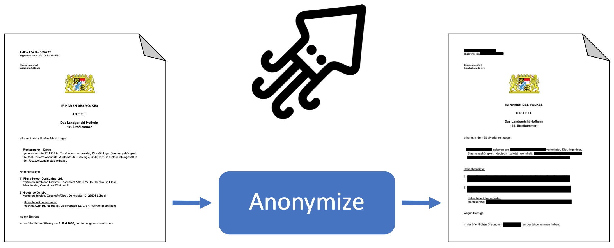
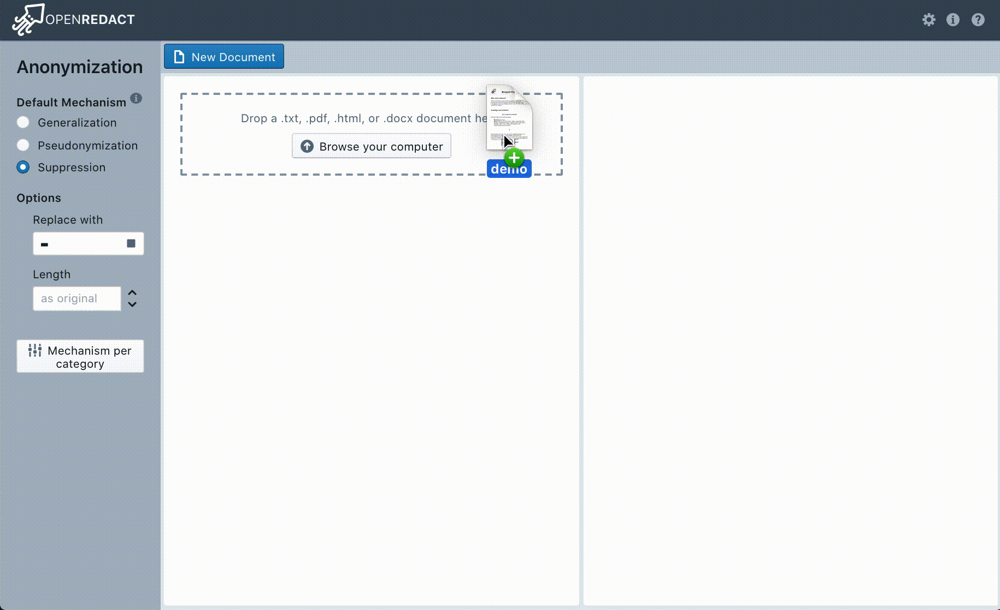
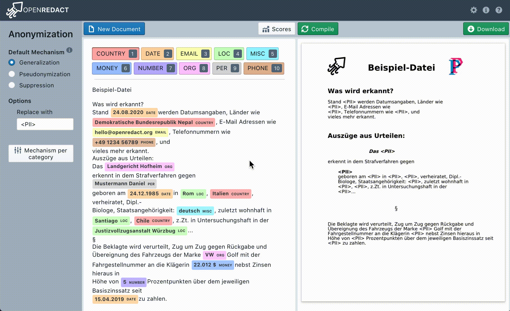
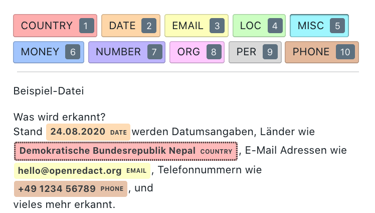
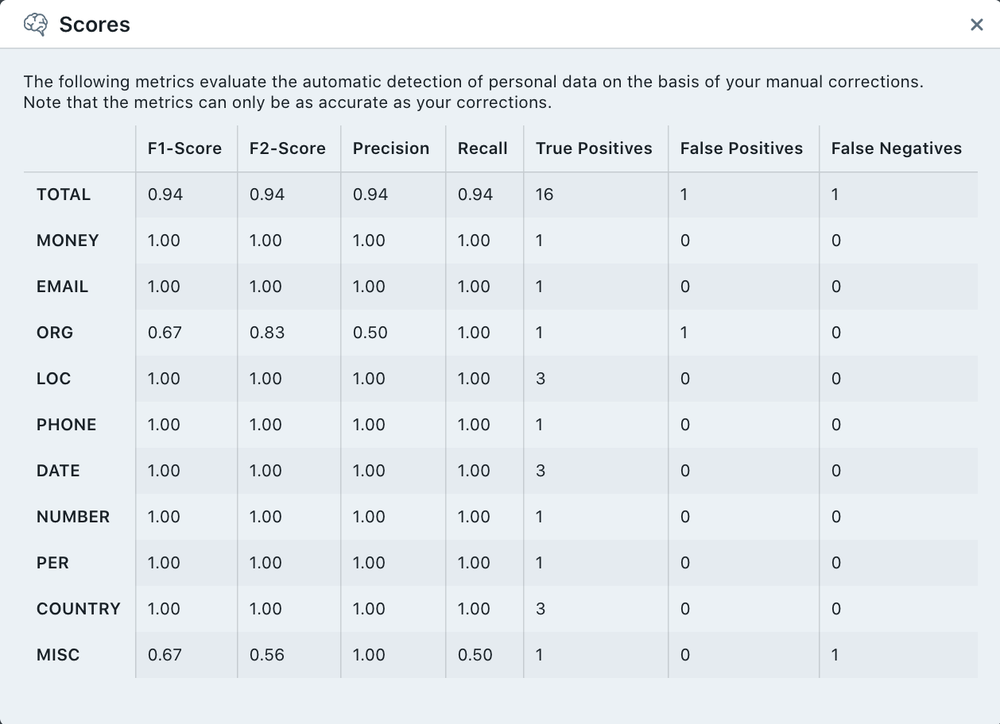

# OpenRedact

**Semi-automatical data anonymization for German documents.**

---

<!---[!Tests](https://github.com/openredact/openredact-app/workflows/Tests/badge.svg?branch=master)-->

[](http://opensource.org/licenses/MIT)
[](https://github.com/ambv/black)
[](https://github.com/prettier/prettier)


_**:warning: Disclaimer :warning::**_ This is a prototype. Do not use for anything critical.

_**:warning: Note :warning::**_ This tool focuses on the text content. Metadata will not be anonymized.

## Description

This repository is the home to the OpenRedact app, a webapp for semi-automatical anonymization of German documents.
[OpenRedact](https://openredact.org) is a [Prototype Fund](https://prototypefund.de) project, funded by the [Federal Ministry of Education and Research](https://www.bmbf.de).
Please see our [blog post](https://openredact.org/prototypefund) for a detailed description of the project and prototype.



## CLI

You can use the CLI script `backend/cli/redact.py` to anonymize a directory of documents in an unsupervised manor.

```shell script
./redact.py --input_dir "path/to/documents/" --output_dir "out/directory/"
```

Call `./redact.py --help` for usage instructions and important notes.

## Webapp

### OpenRedact works with document file formats

This screencast walks you through the anonymization of a document, from upload to download of the anonymized file.



### OpenRedact supports different anonymization methods

This screencast demonstrates the different anonymization methods that OpenRedact supports.
The modifications on the left are immediately previewed on the right.



### OpenRedact comes with an annotation tool

The automatically detected and proposed personal data can be corrected and extended by the user using our annotation tool.



### OpenRedact tells you how good its automatic personal data detection is

Based on the manual corrections and extensions, we can assess the mechanism for automatic detection of personal data.



## Deployment

The app is best deployed using Docker.

### Run the full stack using Docker-Compose

We have pre-built Docker images available at https://hub.docker.com/u/openredact.

Pull and start the containers by running:

```bash
docker-compose pull
docker-compose up
```

This will host the backend at port 8000 and the frontend at port 80.
Once started, you can access the webapp at http://localhost/.

### Run the frontend using Docker

```bash
cd frontend
docker build -t openredact-frontend .
docker run -p 80:80 openredact-frontend
```

This will build the frontend inside a node Docker container and deploy the result in an nginx container.
For more details about this procedure see [React in Docker with Nginx, built with multi-stage Docker builds, including testing](https://medium.com/@tiangolo/react-in-docker-with-nginx-built-with-multi-stage-docker-builds-including-testing-8cc49d6ec305).

### Run the backend using Docker

```bash
cd backend
docker build -t openredact-backend
docker run -p 8000:8000 openredact-backend
```

## API Documentation

Documentation of the API is available at the endpoints `/docs` ([Swagger UI](https://swagger.io/tools/swagger-ui/))
and `/redocs` ([ReDoc](https://redocly.github.io/redoc/)), e.g. http://127.0.0.1:8000/redoc.
The OpenAPI specification can be found [here](http://127.0.0.1:8000/openapi.json).

## Development

For development follow these instructions and the instructions in the development documentation of the respective
module [backend](backend/README.md) or [frontend](frontend/README.md).

### Developing using Docker

If you want to use our Docker setup for development run:

```bash
docker-compose up -f docker-compose.dev.yml
```

### Install the pre-commit hooks

`pre-commit` is a Python tool to manage git pre-commit hooks.
Running the following code requires the backend dev requirements to be set up as explained [here](backend/README.md).
We have pre-commit hooks for formatting and linting Python and JavaScript code (black, flake8, prettier and eslint).
Note, that the tests, being slower than formatters and linters, are run by CI.
So don't forget to run them manually before committing.

```bash
pre-commit install
git config --bool flake8.strict true  # Makes the commit fail if flake8 reports an error
```

To run the hooks:

```bash
pre-commit run --all-files
```

## How to contact us

For usage questions, bugs, or suggestions please file a Github issue.
If you would like to contribute or have other questions please email hello@openredact.org.

## License

[MIT License](https://github.com/openredact/openredact-app/blob/master/LICENSE)
